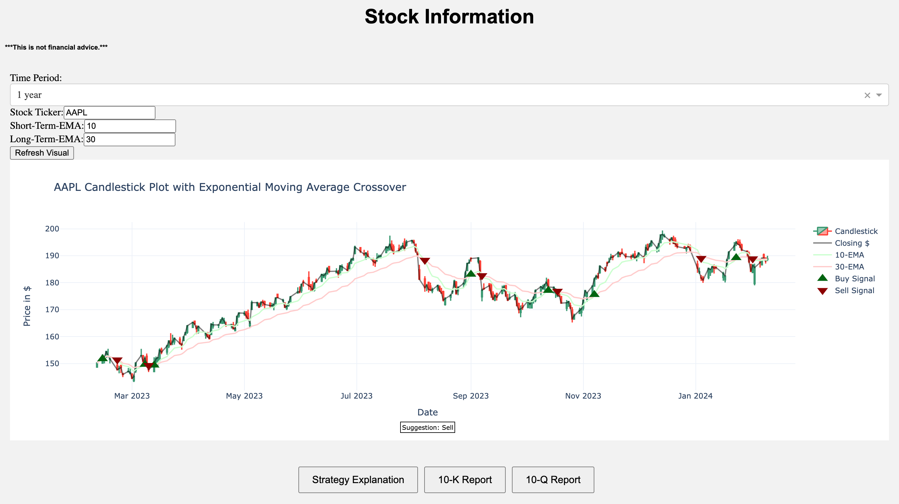

# Stock Visualizer with EMA Indicators

This web application, built using FastAPI and Dash, provides an interactive platform to visualize stock data with Exponential Moving Average (EMA) indicators. Users can select a stock symbol, choose a time period, and specify short-term and long-term EMA windows to analyze the stock's performance and identify potential buy or sell signals based on EMA crossovers.

## Features

- Interactive stock visualization with options to select different stocks and time periods.

- Customizable short-term and long-term EMA indicators.

- Automatic update of the stock chart upon request with a refresh button.

- Display of buy and sell signals based on EMA crossover strategy.

- Access to the latest 10-K and 10-Q for in-depth company analysis.

## How to use

1. Select a Stock and Time Period: Use the dropdown menus and input fields to choose a stock symbol (e.g., AAPL for Apple Inc.) and a time period for analysis (e.g., 1 year).

2. Specify EMA Windows: Input the number of days for the short-term and long-term EMA windows to tailor the analysis to your trading strategy.

3. Refresh Visualization: Click the "Refresh Visual" button to update the graph with the selected parameters.

4. Analyze Buy/Sell Signals: Observe the buy (green triangles) and sell (red triangles) signals on the stock chart based on EMA crossovers.

5. Access SEC Filings: Use the provided links to download the latest 10-K, 10-Q SEC filings for the selected stock.

## Technologies Used

- **Backend:** FastAPI, SQLite
- **Frontend:** HTML, CSS, Plotly Dash
- **Data Source:** Yahoo Finance for stock data, SEC Edgar for company filings.

## EMA Strategy

The Exponential Moving Average (EMA) is a type of moving average that places a greater weight and significance on the most recent data points. The application uses EMA crossover points as signals for potential buying or selling opportunities:

1. **Buy signal**: 
   - Generated when the short-term EMA crosses above the long-term EMA, indicating an upward trend.

2. **Sell signal**:
   - Generated when the short-term EMA crosses below the long-term EMA, indicating a downward trend.

This strategy helps traders identify moments when a stock's momentum is changing, potentially offering opportunities for profitable trades.

## Installation

To run this application, you need Python installed on your system. Follow these steps:

1. Clone or download this repository to your local machine.
2. Navigate to the project directory in your terminal.
3. Install required dependencies: `pip install fastapi uvicorn dash yfinance plotly numpy pandas sec_edgar_downloader`
4. Start the FastAPI server: `uvicorn main:app --reload`
5. Open a web browser and go to `http://127.0.0.1:8000/` to access the application.
6. Optionally, the Dash app will run on a different port (e.g., http://127.0.0.1:8050/) if accessed directly.
